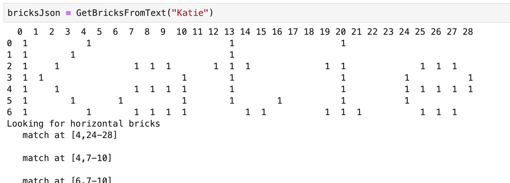
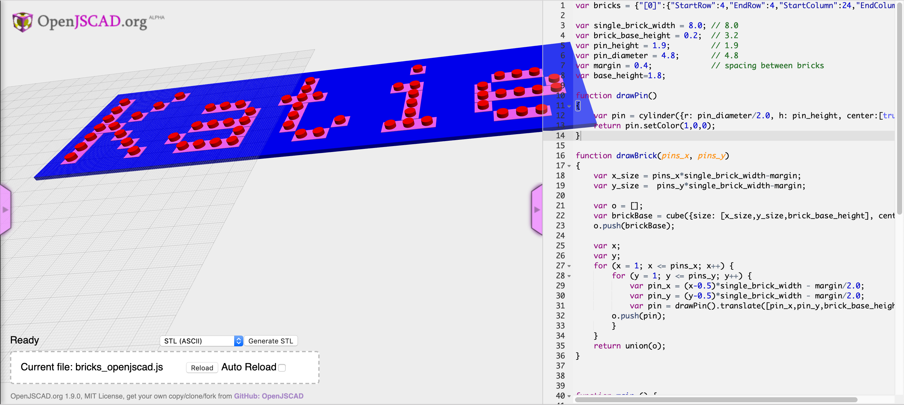
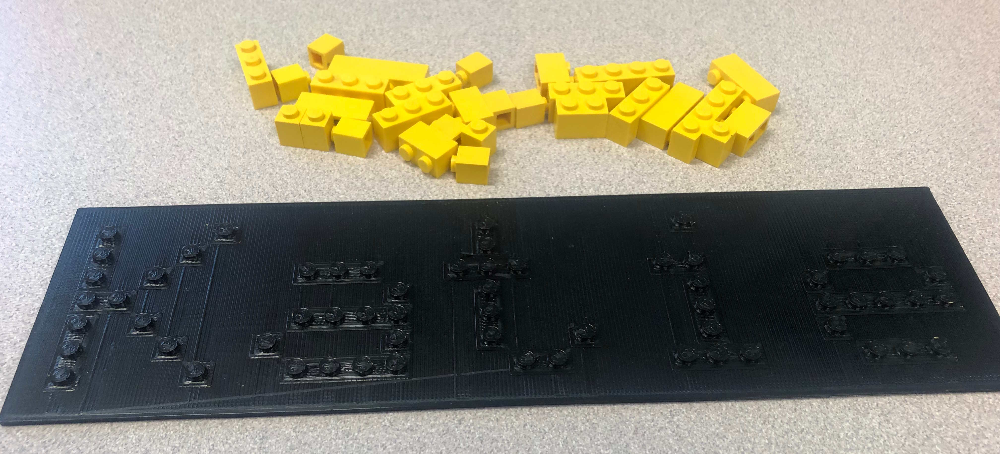
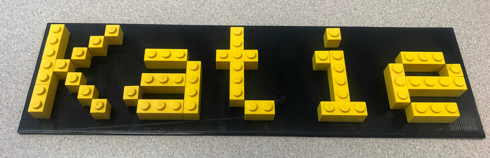

# lego-word-3d-modeller
Create a 3D printable Lego style model from a given word or sentence

## Example nameplate for my daughter, Katie
#### Name represented as bits in a pandas dataset
The pandas dataset is searched horizontally then vertically to combine adjacent single bricks.


#### 3D model in Openjscad


#### Printed nameplate base


#### Nameplate with bricks


## Setup

### Create list of bricks from text
* Install [Anaconda](https://www.anaconda.com/download/#macos) so you have a full Jupyter notebook environment.
* Open 'Anaconda Navigator' and run JupyterLab.
* Open TextToBricks.ipynb in JupyterLab.
* Execute all code blocks in TextToBricks to set up necessary helper functions
* Change text of last command to the text you want rendered
```Python
GetBricksFromText("Katie")
```
* jsonified list of bricks + brick_maker.js -> bricks_openjscad.js


### Render list of bricks into 3D printable .stl
* In a browser, open [Openjscad](https://openjscad.org/#).
* Drag your bricks_openjscad.js file into the bottom file load section of the openjscad web page.
* After your 3D model renders, click the "Generate stl" button then download the stl and print it.
